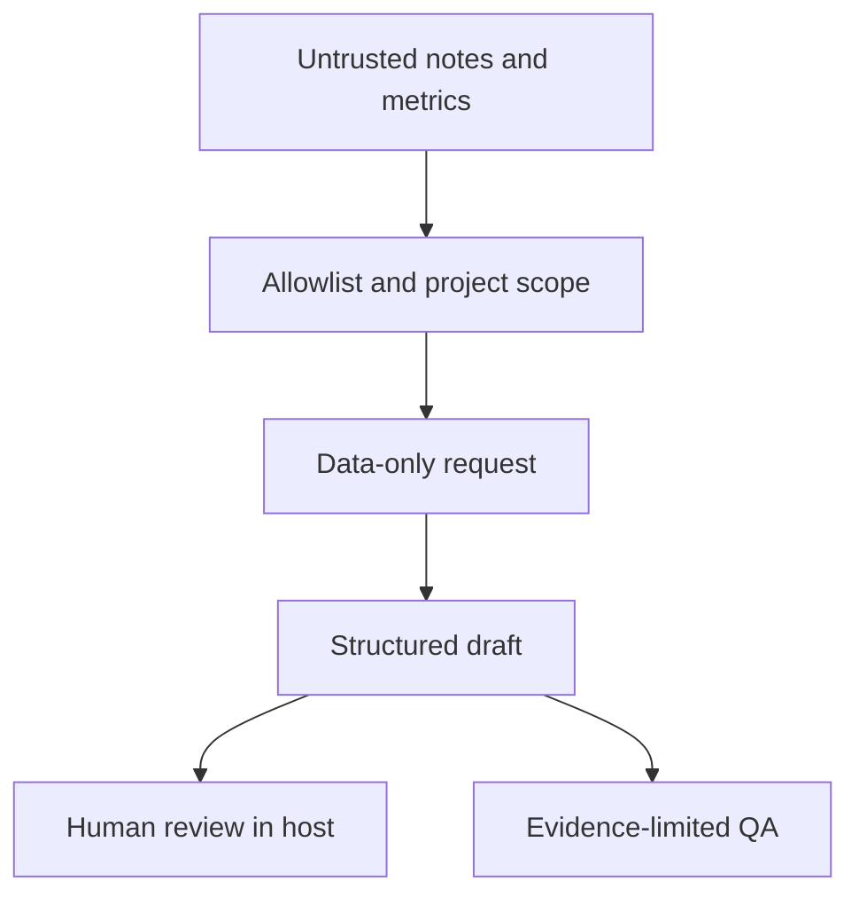

# Sonorama Agent Spec

Inspectable contracts for a creative-direction agent: structured artifacts, project isolation, explicit evidence limits and a role boundary without operational capabilities.

Creative suggestions must not silently become permission to render, publish or spend. Sonorama separates untrusted project material from the host's identity and capabilities, and distinguishes a draft recommendation from approval.

## Included

The package extracts real validation and request-preparation functions from the inspected Sonorama adapter. It includes `CreativeBrief`, `VisualThesis`, `VisualBible` and `CreativeQAResult` types; project-scoped versioned artifacts; content hashes; event routing; annotation-only repetition checks; and an original public [constitution](CONSTITUTION.md).



The arrow from request to draft describes the contract. **No LLM is called in this package.** The demo constructs a synthetic draft and verifies its envelope; it does not simulate a successful model response. Host review is an integration boundary, not an implemented approval UI.

## Run

Node.js 24 or later. No dependencies, API keys or model weights.

```sh
git clone https://github.com/walteryanko/sonorama-agent-spec.git
cd sonorama-agent-spec
npm test
npm run demo
```

See `schemas/` for JSON Schema documents and `examples/sample-project.json` and `examples/sample-events.json` for original synthetic data. Runtime validation remains authoritative for relationships that JSON Schema alone does not express here, such as verdict consistency and complete, nonduplicated QA dimensions.

## Tested

Eleven tests cover artifact round trips, project isolation, hash tampering, text injection held as data, forbidden operational actions, extra identity/tool fields, missing versus nonfinite metrics, disabled features, limited storyboard QA, rejection of incomplete QA and authenticated-source routing.

The public excerpt tightens CreativeQA to require all ten dimensions. Private identity prompts, preference taxonomy, operational addenda, agent bindings, production identifiers and memory persistence are excluded. The public constitution was written for this excerpt.

## Limits

These are deterministic boundary tests, **not** proof that an LLM resists every prompt injection. No live model, pixel inspection, audio listening, rendering, memory database or publishing pipeline was tested here. `allowed_tools: []` is data; the integrating host must actually withhold capabilities. A hash detects changed content relative to a trusted value; it does not authenticate the author. The allowlisted operation catalog describes potential requests, not seventeen implemented creative generators. Annotation-only QA cannot claim to have reviewed unseen frames.

See [provenance](docs/PROVENANCE.md) and [schema notes](schemas/README.md).

## License and product boundary

Sonorama's public specification demonstrates creative-agent architecture, structured outputs and safety boundaries. Production memory, private integrations and project data are not included.

MIT covers the selected public contracts, specification, synthetic examples, tests and original documentation. The private Creative Memory, personal preference data, client memories, unreleased productions and private operational prompts are not included.

See [LICENSE](LICENSE) for the unmodified MIT text and [LICENSE_SCOPE.md](LICENSE_SCOPE.md) for scope and branding. `private: true` prevents accidental publication to the npm registry; it does not restrict the public repository's license.

## Continuous verification

The [Verify workflow](.github/workflows/verify.yml) runs the real tests and CLI demo on Node 24. See [GitHub Actions](https://github.com/walteryanko/sonorama-agent-spec/actions) for current run results. No separate lint or static typecheck is configured. Historical local test results describe this excerpt only.
